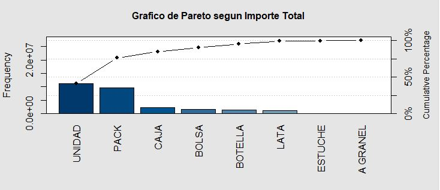

```{r setup, include=FALSE}
library(flexdashboard)
```

```{r}
library(readxl)
Importes_para_R_trabajo_final <- read_excel("F:/tareafinderstudio/Trabajofinalbreick/Importes para R trabajo final.xlsx")
```

# Presentación

Column {data-width=650}
-----------------------------------------------------------------------

### Universidad Catolica Boliviana "San Pablo"

{width=0.5%}

Column {data-width=350}
-----------------------------------------------------------------------

### Daniel Alberto Laguna Levy
{width=16%} ![dantonylagu@gmail.com]


### Andrea Ivonne Capo Montalvo

{width=20%} ![capoandre97@gmail.com]

### Gabriela Paola Cuellar Soria Galvarro

{width=18%} ![11.gabrielac@gmail.com]

### Augusto Ludwing Alarcon Ortiz

{width=16%}
![augustoludwing@gmail.com]

# Descripción del Caso

Column {data-width=400}
-----------------------------------------------------------------------

### Problematica Actual

El problema actual al que se enfrenta la industria de chocolates en Bolivia es que invierte muchos recursos pero el retorno no es significativo.  Por lo cual, se sugiere que la misma esta destinando recursos para la gestión de artículos que no aportan que en muchos casos no cubren su costo o lo cubren y generan una ganancia minima.

Los recursos de los que se dispone para evaluar el problema son:

• Tabla de datos actual de productos

Las variables a medir son: 

• Ventas 

• Ingresos

### Objetivos

• Determinar y clasificar los productos en tres grupos: los mas vendidos, lo que se venden regularmente y los que no se venden ó se venden muy poco.

• Determinar cuales son los productos que generan mayor ingreso para la empresa.

• Redistribuir los esfuerzos para una aplicación mas eficiente.

• Identificar los productos clase A para asegurar su disponibilidad.

• Identificar los productos clase C para la evaluación de su factibilidad en la producción.

Column {data-width=600}
-----------------------------------------------------------------------

### Marco Teorico

• Evaluación Agregada: Una Innovación en la Gestión de Inventarios en una Empresa de Alimentos de Consumo Masivo

La fabricación y/o comercialización de grandes cantidades de uno o varios productos muchas veces llevan a las empresas a incurrir en altos costos de inventarios, infraestructura, personal, y otros factores que pueden afectar la rentabilidad de la compañía.

Cuando se habla de administración de inventarios se tiene dos aspectos que oponen el uno al otro. Por un lado, se requiere minimizar la inversión en inventario, pero por otro, es necesario contar con suficiente stock para abastecer al mercado. Dada esta situación, aplicar métodos que permitan equilibrar ambos aspectos es muy importante.

El análisis ABC es un método que permite dividir grupos de artículos en tres categorías, de tal forma que los directivos concentren esfuerzos en aquellos productos cuyo valor monetario es alto. Generalmente los artículos de clase A representan solo el 20% del total de artículos, pero les corresponde el 80% del valor de consumo. Los artículos B representan el 30% del total, pero le corresponde el 15% del valor de consumo, y finalmente los artículos C representan el 50% y corresponden al 5% del valor de consumo.


• Improving the Decision Making Process Trought the Pareto Principle Application

El principio de Pareto puede ser aplicado para indicar cuales son las prioridades para resolver un problema. Separando los pocos esenciales de los muchos triviales, los equipos pueden mejorar su rendimiento.

La metodología a seguir es:

Paso 1: Desarrollar la lista de items a ser analizada.

Paso 2: Corregir posibles aspectos a considerar.

Paso 3: Preparar una tabla con 3 columnas donde la primera contendra información acerca del fenomeno. La segunda el porcentaje de cada item respecto al total. Y la tercera, porcentajes individuales agregados de la segunda columna.

Paso 4: Cuando todo haya sido calculado, desarrollar una representación gráfica.

Paso 5: Analizar los diagramas indentificando aquellos items que aparecen con más frecuencia. En caso de que no existiese ningún valor aparente, incluir algunos otros aspectos en el análisis.

• Gestión de compras e inventarios a partir de pronósticos Holt-Winters y diferenciación de nivel de servicio por clasificación ABC

En la actualidad, la importancia de los inventarios se ha incrementado dado que se invierte grandes cantidades de capital en ellos, además de que asegurar su disponibilidad es esencial para satisfacer a los consumidores. 

Por ello, el objetivo es minimizar el capital de trabajo invertido en ciertos productos, tomando como restricción principal el cumplimiento de niveles de servicio. Para ello se propone basar las decisiones en una clasificación ABC por volumen de ventas.

Este modelo ya fue exitosamente implementado en empresas comerciales y sociales, sin importar la cantidad de ítems en los almacenes, siendo estos muy grandes o muy pequeños, ayudó a reducir costos en el capital humano, y aumentando el nivel de servicio a los clientes.

• Análisis de la Clasificación ABC y su Incidencia en los Niveles de Inventarios para una Empresa Distribuidora de Cósmeticos

En el artículo citado, la empresa se enfrenta a un problema de clasificación de artículos similar al de la empresa que se estudia. Mismo que se solucionó aplicando la clasificación de inventarios ABC de tal forma que permitió tener un adecuado control sobre su nivel de inventarios y enfocar recursos en aquellos productos de mayor importancia.

En este caso, la empresa valoró el inventario basado en su rotación tomando en cuenta los valores de importe total ingresado de cada producto en base a los datos históricos de ventas de la empresa. Estos indicadores de gestión le permitieron a la institución diferenciar la cantidad de esfuerzos a concentrar en cada producto de la siguiente manera:

### Grafico ABC

{width=90%}

# Datos

Column {data-width=400}
-----------------------------------------------------------------------
### Grafico de Pareto

{width=80%}

### Importe por mes

{width=80%}

Column {data-width=200}
-----------------------------------------------------------------------

### Productos Clase A

Segun el grafico mostrado, se considera productos clase A aquellos que vienen en las siguientes presentaciones:

• Unidad

• Pack

### Productos Clase B

Segun el grafico mostrado, se considera productos clase B aquellos que vienen en las siguientes presentaciones:

• Caja

• Bolsa

• Botella

### Productos Clase C

Segun el grafico mostrado, se considera productos clase C aquellos que vienen en las siguientes presentaciones:

• Lata

• Estuche

• A granel

# Clasificación ABC

Column {data-width=500}
-----------------------------------------------------------------------

### Tabla

Tipo de Productos  | % Acumulado | Clasificacion
------------------ | ------------|--------------
Unidad             | 40,7%      |A
Pack               | 76,3%      |A
Caja               | 84,5%      |B
Bolsa              | 90,4%      |B
Botella            | 95,3%      |B
Lata               | 99,5%      |C
Estuche            | 99,8%      |C
A granel           | 100%       |C


Column {data-width=500}
-----------------------------------------------------------------------

### Conclusiones

Los criterios de clasificación ABC fueron los siguientes:

Clasificación      | Criterio 
------------------ | ------------------
 Producto clase A  |        0% - 80%
 Producto clase B  |        81% - 95%
 Producto clase C  |        96% - 100%

Los productos clase A que estan en el umbral del 80% son aquellos productos que representan mayores ingresos para la empresa, y dado su alta rotación se debe asegurar su disponibilidad con un nivel de servicio del 98%. Del mismo modo se deben enofcar los esfuerzos de todas las areas para asegurar, promover y evaluar estos productos.


### Bibliografia

• Álvarez, R. (1-4 de Junio de 2010). [Evaluación agregada: Una innovación en la gestión de inventarios en una empresa de alimentos de consumo masivo](). 8ª Latin American and Caribbean Conference for Engineering and Technology , 1-8.

• Ivančić, V. (2014). [IMPROVING THE DECISION MAKING PROCESS TROUGHT THE PARETO PRINCIPLE APPLICATION](https://www.mendeley.com/catalogue/4389ceeb-3072-317d-884d-01c04771f57b/). Ekonomska Misao i Praksa, 23(2), 633–656.

• Arango Marin, Giraldo Garcia, & Castrillón Gómez (2013), [Gestión de compras e inventarios a partir de pronósticos Holt-Winters y diferenciación de nivel de servicio por clasificación ABC](https://www.redalyc.org/pdf/849/84929984023.pdf), Scientia Et Technica, 6.

• Mahecha (2019) [Análisis de la clasificación ABC y su incidencia en los niveles de inventarios para una empresa distribuidora de cosmeticos](https://repository.unimilitar.edu.co/handle/10654/31981), 14.
